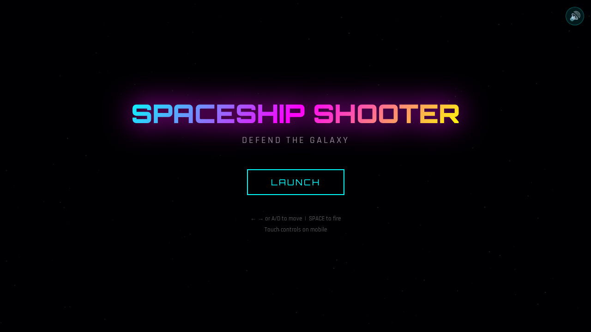
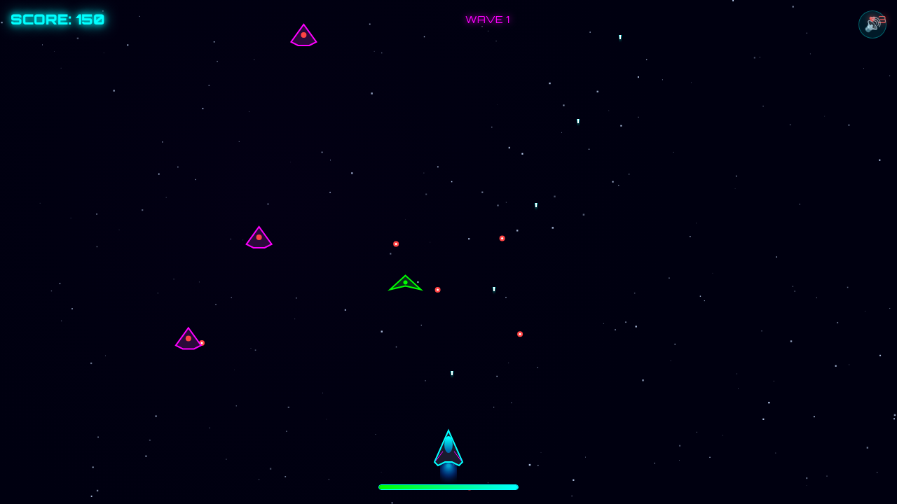
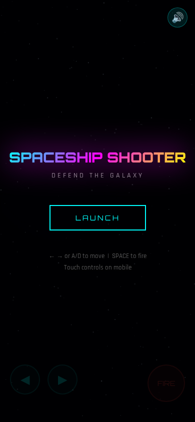
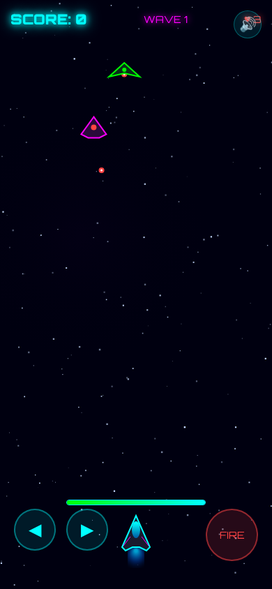

# 🚀 Spaceship Shooter Game

A horizontal side-scrolling space shooter built with vanilla HTML5 Canvas and JavaScript. No frameworks, no dependencies — just pure browser gaming.

Original game by [Alfred Ang](https://github.com/alfredang), preserved under the MIT License.

## 🎮 Play Now

**[▶ Play Spaceship Shooter](https://alfredang.github.io/spaceship-shooter-game/)**

## 📸 Screenshots

> These upstream screenshots preserve the original Phase 0 vertical layout. Phase 1A gameplay now uses a horizontal layout while retaining the same art style.

<div align="center">

### Start Screen


### Gameplay


### Mobile
 &nbsp; 

</div>

## 🛸 Features

- **One deterministic stage** — three enemy sections followed by a final boss
- **Horizontal shooter flow** — player on the left, enemies entering from the right
- **Free eight-direction movement** — normalized WASD, arrow-key, and touch movement
- **4 enemy types** — Basic, Fast, Tank, and Boss enemies
- **Weapon upgrades** — collect powerups to upgrade to triple-shot
- **Health & lives system** — survive as long as you can
- **Particle effects** — explosions, screen shake, engine glow
- **Mobile support** — four-direction multi-touch controls plus two-axis swipe movement
- **Boss fight** — Stage 1 ends with the original boss archetype
- **🔊 Sound effects** — all synthesized via Web Audio API
- **Mute toggle** — sound on/off button in the top-right corner

## 🎯 Controls

| Platform | Move | Fire |
|----------|------|------|
| Desktop | WASD or arrow keys | Space |
| Mobile | Four-direction touch pad / two-axis swipe | Fire button |

## 🖼️ Tech Stack

| Technology | Purpose |
|-----------|---------|
| HTML5 Canvas | Game rendering |
| Vanilla JavaScript | Game logic |
| Web Audio API | Synthesized sound effects |
| CSS3 | UI overlay & effects |
| Static hosting | Direct `index.html` or GitHub Pages |

## 🏗️ Architecture

```
spaceship-shooter-game/
├── index.html          # Complete game (single file)
├── screenshots/        # Game screenshots
├── LICENSE             # MIT license and original attribution
├── PHASE0_AUDIT.md     # Verified original baseline audit
├── PHASE1A_REPORT.md   # Horizontal Stage 1 implementation report
└── README.md
```

## 🚀 Getting Started

```bash
# Clone the repo
git clone https://github.com/alfredang/spaceship-shooter-game.git

# Open in browser
open index.html
```

No build step needed — it's a single HTML file.

## 📝 License

MIT — see [LICENSE](LICENSE).
